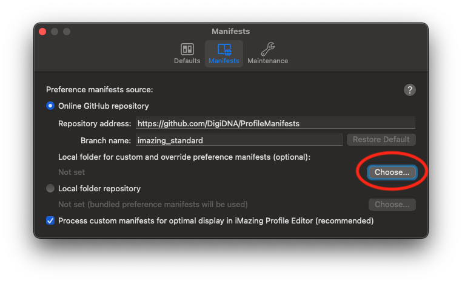

# Installation and Configuration

## Privacy preference Policy Control

In order to function Monitor 24 requires that it allow Full Disk Access (SystemPolicyAllFiles). This can be deployed using MDM.

An example configuration profile is included [here](../Configuration%20Profiles/Monitor24%20Full%20Disk%20Access.mobileconfig)

Alternatively create a configuration profile granting SystemPolicyAllFiles to the Bundle ID `com.jgisaw24.Monitor24`

With the following Code Requirement

```
anchor apple generic and identifier "com.jigsaw24.Monitor24" and (certificate leaf[field.1.2.840.113635.100.6.1.9] /* exists */ or certificate 1[field.1.2.840.113635.100.6.2.6] /* exists */ and certificate leaf[field.1.2.840.113635.100.6.1.13] /* exists */ and certificate leaf[subject.OU] = "563MYW3H73")
```

## Monitor24 Configuration Manifest

Configuration of Monitor24 is via configuration profile. Included is a profile manifest that can be used with [iMazing Profile Editor](https://imazing.com/profile-editor), this is the easiest way to configure Monitor 24.

Hopefully the profile manifest will be included in default repositories soon, in the meantime the manifest can be downloaded here [Profile Manifest](../Profile%20Manifest/com.jigsaw24.Monitor24.plist). Save this file to a folder and within iMazing Profile Editor preferences set a local folder for custom and override preference manifests.



## Quick Start Configuration

This configuration will get you started using Monitor24. This will use iMazing Profile Editor to build the configuration [see here](#monitor24-configuration-manifest)

Under the General Tab check "Enable Recording", "Add Default Filter Rules".

Next choose the Event Types tab and check Log All Event Types.

Next configure the where logs are sent (optional) [Logging](./Logging.md)
