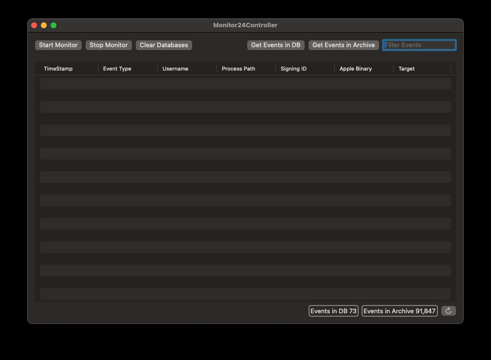

# Monitor24 Controller

Monitor24 Controller is intended to be used for testing/configuration validation only.

| Item                  | Function                                                                              |
| --------------------- | ------------------------------------------------------------------------------------- |
| Start Monitor         | Starts event collection                                                               |
| Stop Monitor          | Stops event collection                                                                |
| Cear Databases        | Removes all events from both current & archive databases                              |
| Get Events in DB      | Loads events in the current database into the interface                               |
| Get Events in Archive | Loads events in the archive database into the interface                               |
| Filter Events         | Allows searching of events (press return to initiate the search)                      |
| Bottom Right Icons    | Show the amount of Events in the current and archive DB with button to refresh these. |

Please note that the usage of this app can be disabled by enabling `Disable Monitor24 Controller` (configuration key `DisableController`)
